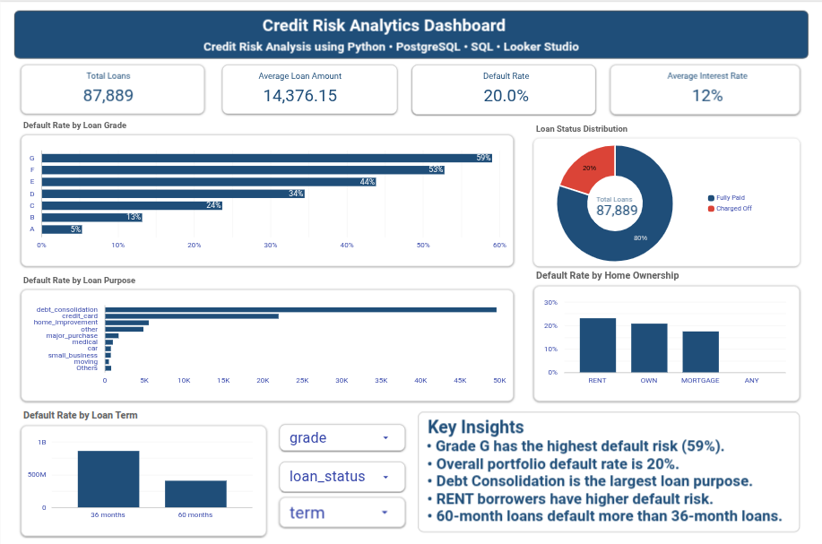
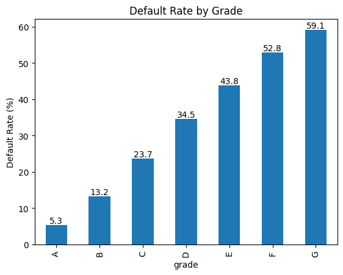
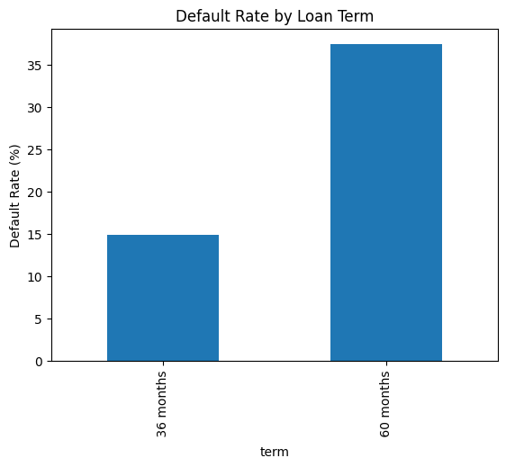
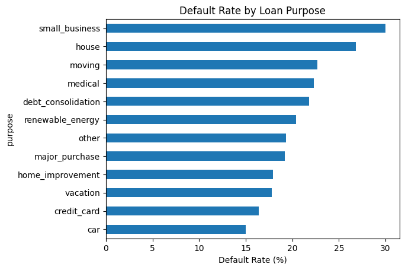
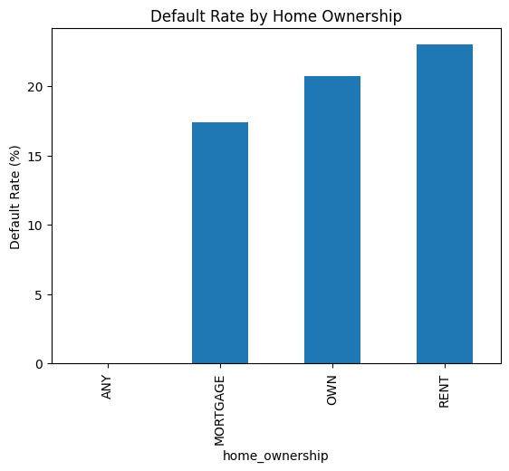

# Lending Club Credit Risk Analysis

## Dashboard Preview

## Dashboard PDF
Download the complete dashboard here:

[Lending Club Credit Risk Dashboard (PDF)](Charts/Lending_Club_Credit_Risk_Dashboard.pdf)

## Interactive Dashboard
View the interactive Looker Studio dashboard here:
(https://datastudio.google.com/reporting/b4f05ea0-3da0-465a-a8a6-c0abf4b33b69)

## Project Overview

This project analyzes historical Lending Club loan data to identify the key factors associated with loan defaults and borrower credit risk.

The objective was to understand how borrower characteristics, loan attributes, and financial indicators influence the likelihood of a loan being fully repaid or charged off.

---

## Business Problem

Financial institutions need to identify high-risk borrowers before approving loans.

This analysis aims to answer:

* Which borrowers are more likely to default?
* How do loan grade, loan term, income, debt-to-income ratio, and loan purpose affect repayment behavior?
* Which borrower segments represent the highest credit risk?

---

## Dataset Information

Source: Lending Club Loan Dataset

Initial Dataset Size: 100,000 loan records

Final Dataset Used: 87,889 loan records

Target Variable:

* Fully Paid
* Charged Off

Selected Features:

* loan_amnt
* term
* int_rate
* grade
* sub_grade
* annual_inc
* home_ownership
* verification_status
* purpose
* dti
* revol_util
* total_acc
* addr_state
* loan_status

---

## Tools and Technologies

* Python
* Pandas
* Matplotlib
* PostgreSQL
* DBeaver
* Git & GitHub

---

## Data Cleaning and Preparation

* Removed columns with extremely high missing values.
* Filtered dataset to include only Fully Paid and Charged Off loans.
* Treated missing values using appropriate imputation techniques.
* Selected relevant features for analysis.
* Exported the cleaned dataset for SQL analysis.

---

## Exploratory Data Analysis (EDA)

Performed analysis on:

* Loan Status Distribution
* Loan Grade vs Default Rate
* Loan Term vs Default Rate
* Loan Purpose vs Default Rate
* Home Ownership vs Default Rate
* Income Analysis
* Debt-to-Income Ratio Analysis

---

## SQL Analysis

Performed SQL-based analysis using PostgreSQL.

Concepts used:

* COUNT()
* AVG()
* ROUND()
* GROUP BY
* ORDER BY
* WHERE
* LIMIT
* HAVING
* CASE WHEN
* ROW_NUMBER()
* RANK()

The SQL analysis was used to validate insights obtained during Python-based EDA.

---

## Key Findings

### Loan Grade

* Grade A loans showed a default rate of approximately 5.3%.
* Grade G loans showed a default rate of approximately 59.1%.

### Loan Term

* 60-month loans had significantly higher default rates than 36-month loans.

### Loan Purpose

* Small business loans had the highest default rates.
* Car loans had the lowest default rates.

### Income

* Borrowers who defaulted generally had lower annual income.

### Debt-to-Income Ratio

* Defaulted borrowers had higher debt-to-income ratios.

### Home Ownership

* Renters exhibited higher default rates than mortgage holders.

---

## Project Structure

├── Lending_Club_Credit_Risk_Analysis.ipynb

├── lending_club_sql_analysis.sql

├── README.md

├── charts/

└── lending_club_analysis.csv

---

## Future Enhancements

* Interactive Tableau Dashboard
* Risk Prediction Model using Machine Learning
* Advanced Borrower Segmentation
* Automated Reporting Dashboard

---

## Conclusion

The analysis identified loan grade, loan term, debt-to-income ratio, income level, and loan purpose as major factors associated with borrower default risk. The findings can help lenders better understand high-risk borrower segments and support more informed lending decisions.

## Sample Visualizations

### Default Rate by Grade

### Default Rate by Loan Term

### Default Rate by Loan Purpose

### Default Rate by Home Ownership

